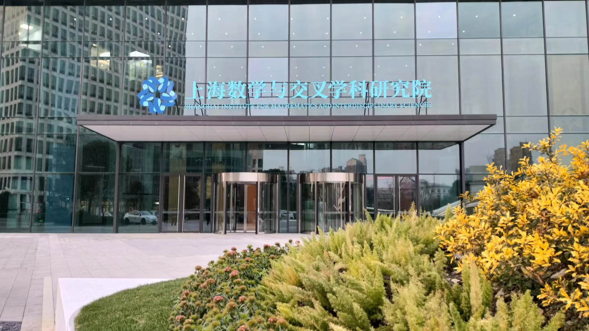
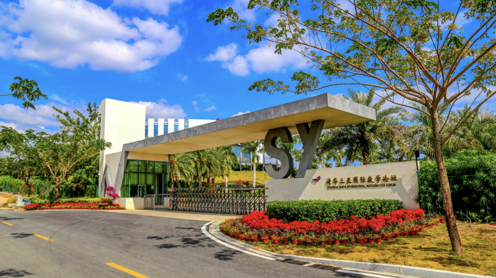

<!-- 
 -->

<table>
<tr>
<td></td>
<td></td>
</tr>
</table>

## General Information
 

 The purpose of the conference is to xxx
 

 

The conference will take place at the <a href="http://www.tsimf.cn/">Tsinghua Sanya International Mathematics Forum (TSIMF)</a>, sponsored by TSIMF and the <a href="https://ymsc.tsinghua.edu.cn/en/">Yau Mathematical Sciences Center at Tsinghua University</a>, during December 11 - 13, 2024.
 

## Registration
Register [here](URL-TBA) to attend in-person.
## Invited speakers 
* xxx (xxx)
* xxx (xxx)
* More to add

## Organizing Committee
* [Zhigang Yao (NUS/Harvard CMSA and Committee Chair)](https://zhigang-yao.github.io/)

## Scientific Advisors: 
* xxx (xxx)
* xxx (xxx)
  
## Contact Information
Scientific Aspects Enquiries: <a href="mailto:zhigang.yao@nus.edu.sg">zhigang.yao(AT)nus.edu.sg</a>

## Schedule

<strong>Monday, Feb. 27, 2023 (Singapore Time)</strong>

<table width="850">
<tbody>
  <tr>
    <td width="150">8:30</td>
    <td colspan="2" >Breakfast</td>
  </tr>
  <tr>
    <td width="150">8:45–8:55</td>
    <td width="200">xxx</td>
    <td width="500">Welcome Remarks</td>
  </tr>
  <tr>
    <td width="150">8:55–9:00</td>
    <td width="200">xxx</td>
    <td width="500">Remarks</td>
  </tr>
  <tr>
    <td width="150"></td>
    <td colspan="2"> <strong>Morning Session Chair:</strong> xxx</td>
  </tr>
  <tr>
    <td width="150">9:00–10:00</td>
    <td width="200">Name TBA</td>
    <td width="500"><strong>Title:</strong> Some title here 
    <strong>Abstract:</strong> Some abstract text here</td>
  </tr>
  <tr>
    <td width="150">10:00–10:10</td>
    <td colspan="2">Break</td>
  </tr>
  <tr>
    <td width="150">10:10–11:10</td>
    <td width="200">xxx</td>
    <td width="500">xxx</td>
  </tr>
  <tr>
    <td width="150">11:10–11:20</td>
    <td colspan="2">Break</td>
  </tr>
  <tr>
    <td width="150">11:20–12:20</td>
    <td width="200">xxx</td>
    <td width="500">xxx</td>
  </tr>
  <tr>
    <td width="150"> 12:20–13:50</td>
    <td colspan="2">Group Photo, followed by lunch</td>
  </tr>
  <tr>
    <td width="00"></td>
    <td colspan="2"> <strong>Afternoon Session Chair:</strong> xxx</td>
  </tr>
  <tr>
    <td width="150">13:50–14:50</td>
    <td width="200">xxx</td>
    <td width="500">xxx</td>
  </tr>
  <tr>
    <td width="150">14:50–15:00</td>
    <td colspan="2">Break</td>
  </tr>
  <tr>
    <td width="150">15:00-16:00</td>
    <td width="200">xxx</td>
    <td width="500">xxx</td>
  </tr>
  <tr>
    <td width="150">16:00-16:10</td>
    <td colspan="2">Break</td>
  </tr>
  <tr>
    <td width="150">16:10-17:10</td>
    <td width="200">xxx</td>
    <td width="500">xxx</td>
  </tr>
</tbody>
</table>

* Virtual Presentation

## Sponsors
<!-- 
 -->

<table>
<tr>
<td width="50%"></td>
<td width="50%"></td>
</tr>
</table>
